# i18n 提取与替换规范

> **重要**: 本文档定义了 i18n 提取和替换的标准流程和规则。**每次进行 i18n 相关工作前，必须先阅读本文档。**

**最后更新**: 2025-01-23  
**状态**: ✅ 已生效

---

## 📋 目录

1. [提取规范](#提取规范)
2. [替换规范](#替换规范)
3. [状态跟踪规范](#状态跟踪规范)
4. [文件结构规范](#文件结构规范)
5. [质量保证规范](#质量保证规范)

---

## 1. 提取规范

### 1.1 提取前必须检查

**⚠️ 每次提取前，必须先执行以下检查**：

```bash
# 1. 检查替换状态文件是否存在
ls -lh i18n_replacement_status.json

# 2. 如果存在，读取并显示当前状态
cat i18n_replacement_status.json | jq '.totalReplaced, .totalPending'

# 3. 检查是否有带状态的提取结果
ls -lh i18n_complete_final_with_status.json
```

**规则**：
- ✅ **必须读取** `i18n_replacement_status.json`（如果存在）
- ✅ **必须跳过** `status: "replaced"` 的内容
- ✅ **必须跳过** 已在 `replaced` 列表中的内容
- ❌ **禁止** 重复提取已替换的内容

### 1.2 扫描范围

**完整扫描目录**（必须全部扫描）：

```typescript
const SCAN_DIRS = [
  'src/telegram/handlers',  // 所有 handlers
  'src/domain',             // 业务逻辑层
  'src/services',           // 服务层
  'src/db',                 // 数据库相关（包括 SQL 文件）
  'src/utils',              // 工具函数
  'src/config',             // 配置文件
];
```

**扫描文件类型**：
- ✅ `.ts` 文件（TypeScript 源代码）
- ✅ `.sql` 文件（数据库迁移和种子数据）
- ❌ 跳过 `.test.ts` 文件（测试文件）
- ❌ 跳过 `node_modules/`
- ❌ 跳过注释（`//`, `/* */`）

### 1.3 提取规则

#### 提取粒度原则

**✅ 必须遵守**：

1. **完整句子/段落**：
   - ✅ 保持语义完整性
   - ✅ 500 字以内的段落都保持完整
   - ✅ 不要拆分过细

2. **按钮文字**：
   - ✅ 可以单独提取（如 "丟瓶子"、"設定"）
   - ✅ 保持简短

3. **错误消息**：
   - ✅ 完整提取（如 "⚠️ 用戶不存在，請先使用 /start 註冊。"）
   - ❌ 不要拆分

4. **模板字符串**：
   - ✅ 包含变量插值的完整模板（如 `"📊 今日已發送：${usedToday}/${dailyLimit} 則"`）
   - ✅ 保持为一个 key

#### 跳过规则

**❌ 以下内容必须跳过**：

1. **注释**：
   ```typescript
   // ❌ 跳过：这是注释
   /* ❌ 跳过：这也是注释 */
   ```

2. **console.log**：
   ```typescript
   console.log('❌ 跳过：这是日志');
   ```

3. **已使用 i18n.t()**：
   ```typescript
   i18n.t('errors.userNotFound')  // ❌ 跳过：已经使用 i18n
   ```

4. **技术标识符**：
   ```typescript
   callback_data: 'lang_zh-TW'  // ❌ 跳过：技术标识符
   ```

5. **正则表达式**：
   ```typescript
   /[\u4e00-\u9fa5]/  // ❌ 跳过：正则表达式
   ```

6. **Emoji 作为状态**：
   ```typescript
   status: '✅'  // ❌ 跳过：Emoji 作为状态指示
   ```

### 1.4 去重机制

**必须实现**：

```typescript
function addExtracted(item: ExtractedContent) {
  // 1. 检查替换状态（如果存在）
  if (replacementStatus) {
    const isReplaced = replacementStatus.replaced.some(r => 
      r.file === item.file && r.line === item.line
    );
    if (isReplaced) {
      console.log(`⏭️  跳过已替换: ${item.file}:${item.line}`);
      return; // 跳过已替换的内容
    }
  }
  
  // 2. 检查文本去重
  const exists = extracted.some(e => e.text === item.text);
  if (!exists) {
    extracted.push(item);
  }
}
```

### 1.5 输出文件

**必须生成**：

1. **`i18n_complete_final.json`** - 提取的原始数据
2. **`i18n_keys_mapping.json`** - Key 映射表
3. **`i18n_scanned_files.txt`** - 扫描的文件列表
4. **`I18N_EXTRACTION_REPORT.md`** - 扫描报告

**可选生成**（如果存在替换状态）：
- `i18n_complete_final_with_status.json` - 带状态的提取结果

---

## 2. 替换规范

### 2.1 替换前必须检查

**⚠️ 每次替换前，必须先执行以下检查**：

```bash
# 1. 检查提取结果是否存在
ls -lh i18n_complete_final.json
ls -lh i18n_keys_mapping.json

# 2. 检查替换状态文件
ls -lh i18n_replacement_status.json

# 3. 确认当前 Git 状态
git status
git log -1 --oneline
```

**规则**：
- ✅ **必须备份** 当前代码（Git commit）
- ✅ **必须读取** key 映射表
- ✅ **必须更新** 替换状态文件
- ❌ **禁止** 直接修改代码（必须先备份）

### 2.2 替换规则

#### 替换方式

**使用 AST 解析替换**（推荐）：

```typescript
// ✅ 正确：使用 AST 解析
import * as ts from 'typescript';

function replaceWithAST(sourceFile: ts.SourceFile, mapping: Map<string, string>) {
  // 使用 TypeScript AST 精确替换
  // ...
}
```

**禁止使用简单字符串替换**：

```typescript
// ❌ 错误：简单字符串替换（容易出错）
content.replace('❌ 無效的語言代碼', "i18n.t('errors.invalidLanguageCode')");
```

#### 替换格式

**标准格式**：

```typescript
// 替换前
await telegram.sendMessage(chatId, '❌ 無效的語言代碼');

// 替换后
const { createI18n } = await import('~/i18n');
const i18n = createI18n(user.language_pref || 'zh-TW');
await telegram.sendMessage(chatId, i18n.t('errors.invalidLanguageCode'));
```

**必须添加 i18n 初始化**（如果不存在）：

```typescript
// 如果文件没有 i18n import，必须添加
import { createI18n } from '~/i18n';

// 在函数中初始化（使用用户的 language_pref）
const i18n = createI18n(user.language_pref || 'zh-TW');
```

### 2.3 替换后必须更新状态

**替换后必须执行**：

```typescript
// 1. 更新替换状态文件
function updateReplacementStatus(file: string, line: number, key: string, original: string) {
  const status = loadReplacementStatus();
  
  status.replaced.push({
    file,
    line,
    original,
    key,
    replacedAt: new Date().toISOString(),
  });
  
  // 从 pending 中移除
  status.pending = status.pending.filter(
    p => !(p.file === file && p.line === line)
  );
  
  status.totalReplaced++;
  status.totalPending--;
  
  saveReplacementStatus(status);
}
```

### 2.4 替换后必须测试

**每个文件替换后必须**：

```bash
# 1. Lint 检查
pnpm lint

# 2. 类型检查
pnpm type-check

# 3. 单元测试（如果有）
pnpm test

# 4. Smoke Test（关键功能）
pnpm smoke-test
```

---

## 3. 状态跟踪规范

### 3.1 状态文件结构

**替换状态文件**：`i18n_replacement_status.json`

```json
{
  "createdAt": "2025-01-23T...",
  "totalExtracted": 1945,
  "totalReplaced": 20,
  "totalPending": 1925,
  "replaced": [
    {
      "file": "src/telegram/handlers/language_selection.ts",
      "line": 83,
      "original": "❌ 無效的語言代碼",
      "key": "errors.invalidLanguageCode",
      "replacedAt": "2025-01-23T..."
    }
  ],
  "pending": [
    {
      "file": "src/telegram/handlers/menu.ts",
      "line": 45,
      "original": "📊 統計數據",
      "key": "menu.stats",
      "extractedAt": "2025-11-22T..."
    }
  ]
}
```

### 3.2 状态字段

**提取结果中的 status 字段**：

- `extracted` - 已提取但未替换
- `replaced` - 已替换
- `pending` - 待处理

### 3.3 状态更新规则

**必须遵守**：

1. **提取时**：
   - ✅ 读取替换状态文件
   - ✅ 跳过 `status: "replaced"` 的内容
   - ✅ 新提取的内容标记为 `status: "extracted"`

2. **替换时**：
   - ✅ 更新替换状态文件
   - ✅ 从 `pending` 移到 `replaced`
   - ✅ 更新提取结果中的 `status` 字段

3. **验证时**：
   - ✅ 检查状态文件是否最新
   - ✅ 验证替换进度

---

## 4. 文件结构规范

### 4.1 提取相关文件

**必须存在的文件**：

```
i18n_complete_final.json              # 提取结果（主文件）
i18n_keys_mapping.json                # Key 映射表
i18n_complete_final_with_status.json  # 带状态的提取结果（如果存在）
i18n_replacement_status.json          # 替换状态文件（如果存在）
i18n_scanned_files.txt                # 扫描的文件列表
I18N_EXTRACTION_REPORT.md             # 提取报告
```

### 4.2 脚本文件

**必须存在的脚本**：

```
scripts/extract-100-percent-coverage.ts    # 提取脚本
scripts/add-status-to-extraction.ts       # 状态分析脚本
scripts/apply-i18n-replacements-final.ts  # 替换脚本
```

---

## 5. 质量保证规范

### 5.1 提取质量

**必须验证**：

1. ✅ **覆盖率**: 100%（所有硬编码都已识别，包括数据库）
2. ✅ **去重**: 没有重复提取
3. ✅ **完整性**: 完整句子/段落，不拆分过细
4. ✅ **跳过规则**: 正确跳过注释、日志等
5. ✅ **数据库内容**: SQL 文件中的中文已提取

### 5.2 数据库硬编码处理

**提取状态**（✅ 已完成）：
- ✅ SQL 文件已扫描：8 个文件包含中文
- ✅ 中文内容已提取：所有数据库中的中文硬编码都已提取
- ✅ 已生成 i18n keys

**替换状态**（❌ 未开始）：
- ❌ 数据库未更新：数据库中的数据仍然是中文
- ❌ 未生成迁移脚本：需要生成迁移脚本
- ❌ 代码未更新：读取数据库数据的代码还没有使用 `i18n.t()`

**处理步骤**：
1. 生成数据库迁移脚本（将中文替换为 i18n keys）
2. 更新代码读取逻辑（使用 `i18n.t()`）
3. 执行迁移并测试

### 5.2 替换质量

**必须验证**：

1. ✅ **准确性**: 使用 AST 解析，100% 准确
2. ✅ **类型安全**: 自动更新 TypeScript 类型
3. ✅ **测试通过**: Lint、类型检查、单元测试全部通过
4. ✅ **状态更新**: 替换状态文件已更新

### 5.3 验收标准

**替换完成后必须**：

1. ✅ **Lint 检查**: `pnpm lint` 通过
2. ✅ **类型检查**: `pnpm type-check` 通过
3. ✅ **单元测试**: `pnpm test` 通过
4. ✅ **Smoke Test**: 关键功能测试通过
5. ✅ **状态文件**: 替换状态文件已更新
6. ✅ **Git 提交**: 代码已提交到 Git

---

## 6. 工作流程

### 6.1 提取流程

```mermaid
graph TD
    A[开始提取] --> B[检查替换状态文件]
    B --> C[扫描所有文件]
    C --> D[提取硬编码]
    D --> E[去重检查]
    E --> F[跳过已替换内容]
    F --> G[生成提取结果]
    G --> H[生成 Key 映射]
    H --> I[生成报告]
    I --> J[完成]
```



### 6.2 替换流程

```mermaid
graph TD
    A[开始替换] --> B[备份代码]
    B --> C[读取 Key 映射]
    C --> D[读取替换状态]
    D --> E[AST 解析替换]
    E --> F[更新状态文件]
    F --> G[Lint 检查]
    G --> H[类型检查]
    H --> I[测试]
    I --> J[Git 提交]
    J --> K[完成]
```



---

## 7. 常见问题

### Q1: 如何避免重复提取？

**A**: 
1. 读取 `i18n_replacement_status.json`
2. 跳过 `status: "replaced"` 的内容
3. 使用文本去重机制

### Q2: 如何知道替换进度？

**A**: 
1. 查看 `i18n_replacement_status.json` 中的 `totalReplaced` 和 `totalPending`
2. 查看 `i18n_complete_final_with_status.json` 中的 `statusDistribution`

### Q3: 提取脚本如何知道哪些已替换？

**A**: 
1. 读取 `i18n_replacement_status.json`
2. 检查代码中是否有 `i18n.t()` 调用
3. 对比提取结果和替换状态

---

## 8. 开发新功能时的 i18n 规范（⚠️ 预防硬编码）

### 8.1 开发前准备

**必须阅读**：
- [ ] `@doc/I18N_GUIDE.md` - i18n 使用指南
- [ ] `@doc/I18N_EXTRACTION_AND_REPLACEMENT_STANDARDS.md` - 本文档

**必须理解**：
- ✅ 所有用户可见文字都必须使用 `i18n.t()`
- ✅ 禁止硬编码中文字符串
- ✅ 新增文字时立即添加到 locale 文件

### 8.2 编写代码时的要求

**✅ 正确做法**：

```typescript
// 1. 导入 i18n
import { createI18n } from '~/i18n';

// 2. 初始化 i18n（使用用户的 language_pref）
const i18n = createI18n(user.language_pref || 'zh-TW');

// 3. 使用 i18n.t() 显示文字
await telegram.sendMessage(chatId, i18n.t('errors.userNotFound'));
await telegram.sendMessageWithButtons(
  chatId,
  i18n.t('menu.welcome'),
  [[{ text: i18n.t('buttons.throwBottle'), callback_data: 'menu_throw' }]]
);
```

**❌ 禁止的做法**：

```typescript
// ❌ 错误：硬编码中文
await telegram.sendMessage(chatId, '❌ 用戶不存在');

// ❌ 错误：先写中文，说「之后再提取」
await telegram.sendMessage(chatId, '歡迎使用 XunNi！');  // TODO: 提取到 i18n

// ❌ 错误：按钮文字硬编码
[{ text: '🌊 丟出漂流瓶', callback_data: 'menu_throw' }]
```

### 8.3 新增文字的处理流程

**当需要新增用户可见文字时**：

1. **先添加到 locale 文件**：
   ```typescript
   // src/i18n/locales/zh-TW.ts
   export const translations: Translations = {
     // ... 现有内容
     newFeature: {
       welcome: '歡迎使用新功能！',
       description: '這是新功能的說明...',
     },
   };
   ```

2. **添加到 types.ts**：
   ```typescript
   // src/i18n/types.ts
   export interface Translations {
     // ... 现有内容
     newFeature: {
       welcome: string;
       description: string;
     };
   }
   ```

3. **在代码中使用**：
   ```typescript
   await telegram.sendMessage(chatId, i18n.t('newFeature.welcome'));
   ```

### 8.4 提交前检查

**必须执行**：

```bash
# 1. 检查硬编码
pnpm check:i18n

# 应该显示：✅ 没有发现硬编码的中文字符串！

# 2. Lint 检查
pnpm lint

# 3. 类型检查
pnpm typecheck

# 4. 测试
pnpm test
```

**如果 `pnpm check:i18n` 发现硬编码**：
1. 立即修复（替换为 `i18n.t()`）
2. 添加到 locale 文件
3. 重新运行检查

### 8.5 代码审查清单

**在提交代码前，自我审查**：

- [ ] 所有用户可见文字都使用 `i18n.t()`
- [ ] 已添加 `import { createI18n } from '~/i18n'`
- [ ] 已初始化 `const i18n = createI18n(user.language_pref || 'zh-TW')`
- [ ] 所有 `sendMessage`、`editMessageText` 等都使用 `i18n.t()`
- [ ] 所有按钮文字都使用 `i18n.t()`
- [ ] 所有错误消息都使用 `i18n.t()`
- [ ] 运行 `pnpm check:i18n` 通过（0 个硬编码）
- [ ] 新增的文字已添加到 `zh-TW.ts` 和 `types.ts`

---

## 9. 检查清单

### 提取前检查清单

- [ ] 检查替换状态文件是否存在
- [ ] 确认扫描目录完整
- [ ] 确认提取规则已理解
- [ ] 确认输出文件路径

### 替换前检查清单

- [ ] 代码已备份（Git commit）
- [ ] 提取结果文件存在
- [ ] Key 映射文件存在
- [ ] 替换状态文件存在

### 替换后检查清单

- [ ] 替换状态文件已更新
- [ ] Lint 检查通过
- [ ] 类型检查通过
- [ ] 测试通过
- [ ] Git 已提交

### 开发新功能检查清单（⚠️ 预防硬编码）

- [ ] 已阅读 `@doc/I18N_GUIDE.md`
- [ ] 已阅读 `@doc/I18N_EXTRACTION_AND_REPLACEMENT_STANDARDS.md`
- [ ] 所有用户可见文字都使用 `i18n.t()`
- [ ] 已添加 `import { createI18n } from '~/i18n'`
- [ ] 已初始化 i18n 实例
- [ ] 新增文字已添加到 `zh-TW.ts` 和 `types.ts`
- [ ] 运行 `pnpm check:i18n` 通过（0 个硬编码）
- [ ] 运行 `pnpm lint` 通过
- [ ] 运行 `pnpm test` 通过

---

**重要**: 本文档是 i18n 提取和替换的**唯一标准**。所有相关工作必须遵循本文档。

**开发新功能时**: **必须遵守第 8 节的规范**，避免产生新的硬编码。

**最后更新**: 2025-01-23

