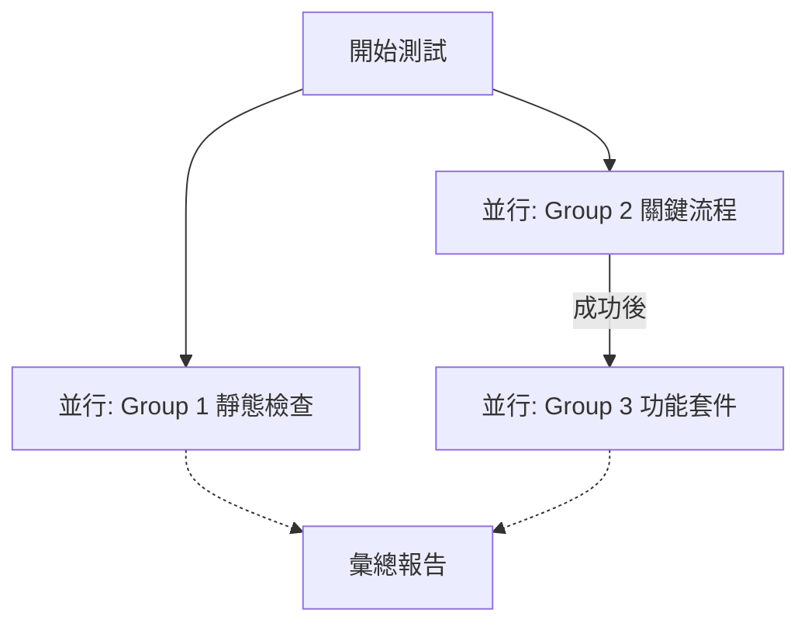

# Smoke Test 優化計畫 (Smoke Test Optimization Plan)

## 1. 現狀分析

目前的 `scripts/smoke-test.ts` 是一個全功能的端對端 (E2E) 測試套件，涵蓋 39 個測試組。

### 瓶頸識別
1.  **序列化執行 (Sequential Execution)**: 所有測試按順序一個接一個執行，導致總耗時極長（>10分鐘）。
2.  **混合型任務**: 需要網絡交互的動態測試（如 Webhook）與只需本地文件讀取的靜態測試（如 i18n 檢查、Migration 檢查）混在一起執行。
3.  **缺乏靈活性**: 必須跑完全套測試，無法只針對特定模組進行快速驗證。
4.  **網絡依賴**: 預設針對 Staging 環境，受網絡延遲影響大。

## 2. 優化目標

1.  **速度提升**: 總執行時間縮短 50% 以上。
2.  **開發體驗**: 支援過濾 (`--filter`) 和本地模式 (`--local`)。
3.  **架構現代化**: 引入並行處理與更好的錯誤報告。

## 3. 實施方案

### A. 測試分組與並行化 (Parallelization)

將測試拆分為三個並行群組 (`Promise.all`)：

1.  **Group 1: Static Checks (靜態檢查)** - *CPU Bound / File I/O*
    *   Migration Completeness (Migration 完整性)
    *   Database Integrity (資料庫邏輯檢查)
    *   i18n Keys / All Pages / Hardcoded / RTL (所有 i18n 相關檢查)
    *   *特點：不依賴網絡，不依賴 Worker 狀態，可完全獨立執行。*

2.  **Group 2: Critical Flow (關鍵流程)** - *Network I/O*
    *   Infrastructure (Health Check)
    *   User Commands (/start, /help)
    *   Onboarding (入職流程)
    *   *特點：必須最先通過，若失敗則後續無意義。此組單獨先行。*

3.  **Group 3: Feature Suites (功能套件)** - *Network I/O*
    *   Admin System, Task System, Ad System 等所有具體功能測試。
    *   *特點：依賴基礎設施，但各功能間相對獨立。*

**執行順序調整：**

### B. 命令行參數支援 (CLI Arguments)

引入參數解析，支援：

*   `--filter <keyword>`: 只執行名稱包含關鍵字的測試 (例如 `pnpm smoke --filter="Admin"`)。
*   `--local`: 將 `WORKER_URL` 指向 `http://127.0.0.1:8787`，並跳過部分僅限線上的檢查。
*   `--skip-static`: 跳過耗時的靜態 i18n 檢查（開發功能邏輯時用）。

### C. 代碼結構重構

1.  **Test Runner Class**: 將散落的 `runTestSuite`、`testEndpoint` 封裝成 `SmokeTestRunner` 類別，管理狀態與配置。
2.  **Timeout 優化**: 為不同類型的測試設置更合理的超時時間。

## 4. 驗證方法

優化完成後，將執行以下驗證：

1.  **完整性檢查**: 確保所有原有測試項目都被執行，沒有遺漏。
2.  **速度對比**: 記錄優化前後的執行時間差異。
3.  **參數測試**: 驗證 `--filter` 和 `--local` 是否按預期工作。
4.  **失敗處理**: 模擬測試失敗，確認錯誤報告依然清晰且不會導致進程卡死。

## 5. 下一步行動

1.  重構 `scripts/smoke-test.ts`。
2.  執行測試並記錄結果。

